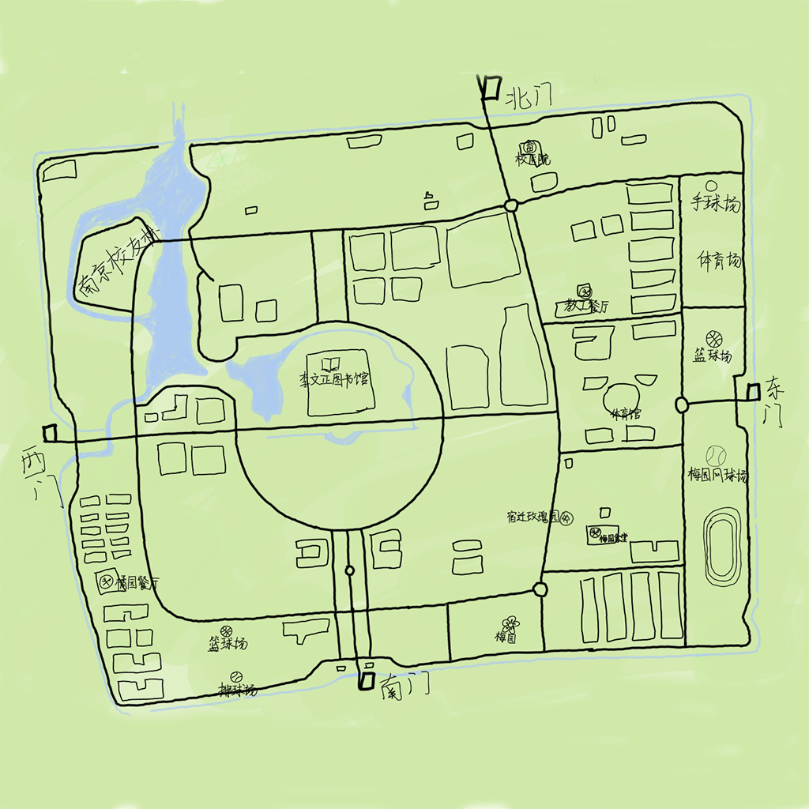

# HackerGo   

Team:   **仗键天涯**

> A game like web app of doing sports and making friends.

---

Team members:  
* [Leodpen](https://www.github.com/leodpen/)
* [Yoshino-s](https://www.github.com/yoshino-s/)
* [RanShuo](https://www.github.com/rs520/)

---

Details: 
1. Using azure.
2. fontend : TypeScript ; backend: Java.
3. Using our own engine - [yogame](https://github.com/Yoshino-s/yogame)
4. database: MySQL , Redis
5. We make our textures totally by ourselves.

---

Partially Display:
    

For the [hackathon at SEU.](https://hackathon2019eastchina.github.io/)  
2019.11.23-24

